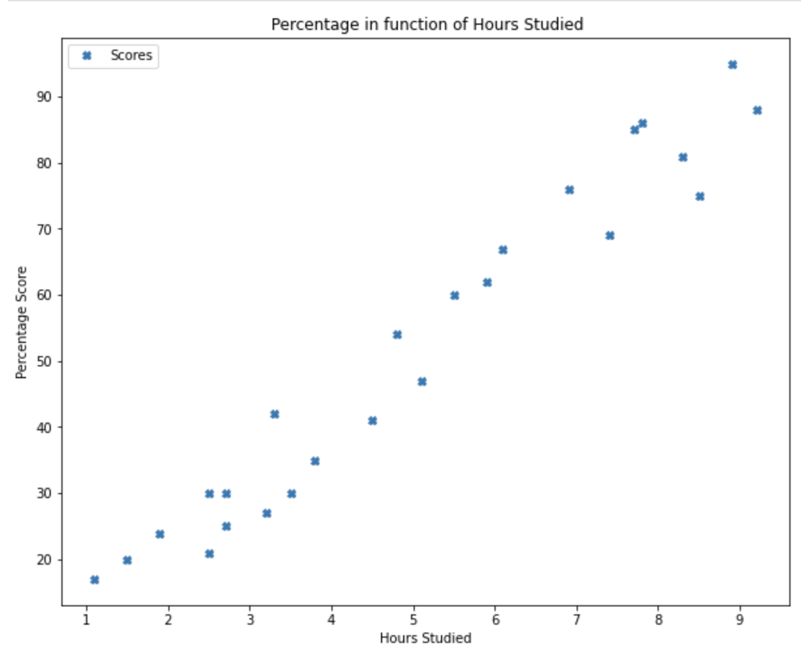
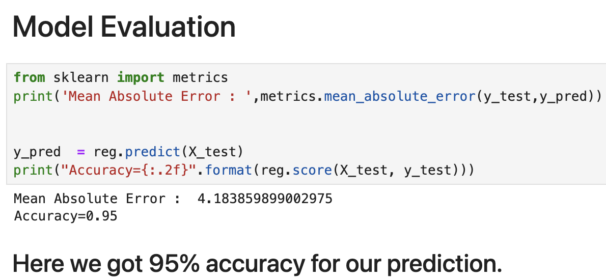
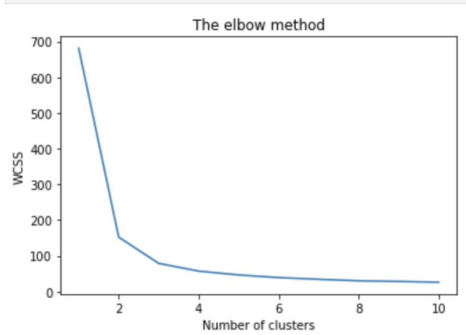
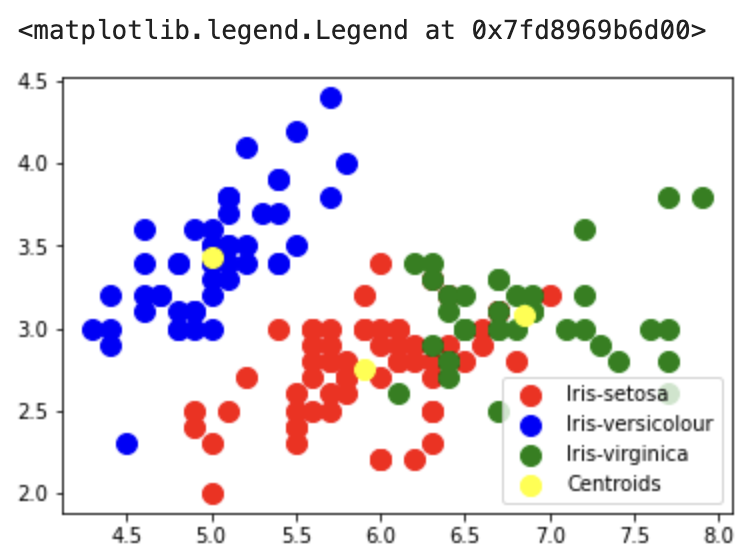
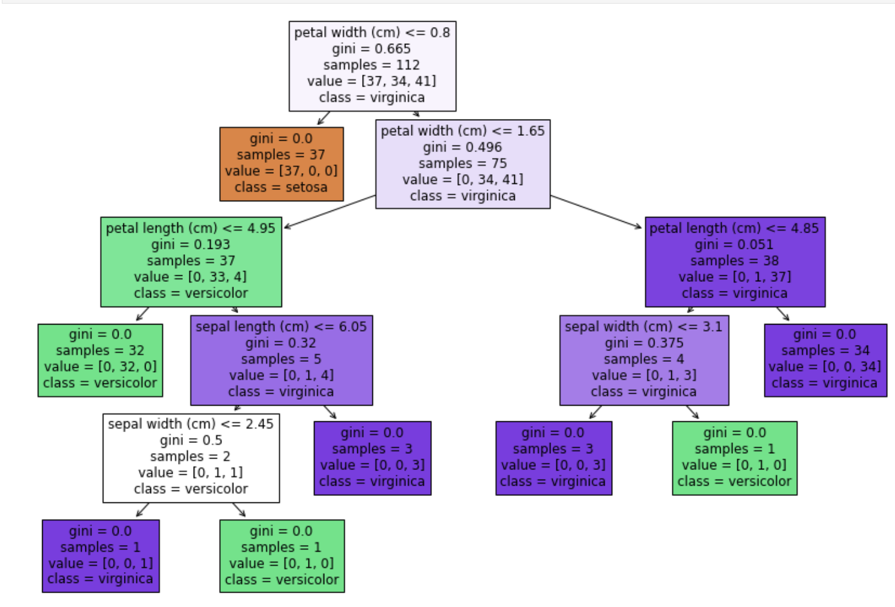
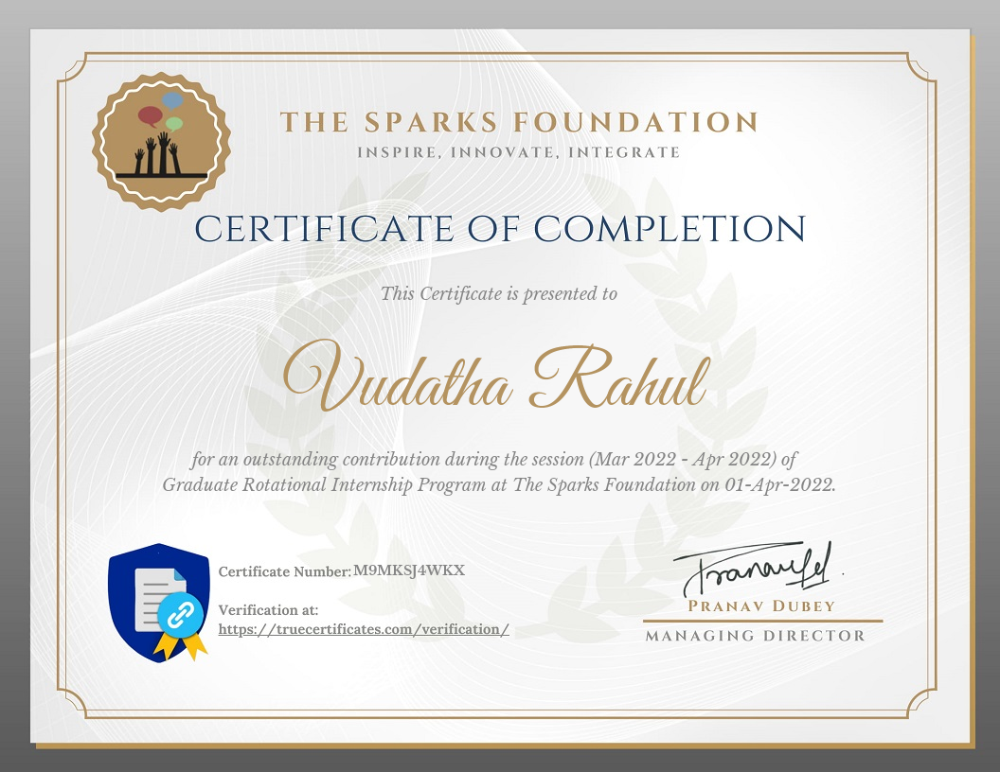

# The Sparks Foundation (GRIP) – Data Analyst Intern | Data Science & Business Analytics

This repository documents my **Data Analyst Internship** experience with **The Sparks Foundation (GRIP – Graduate Rotational Internship Program)**, where I completed a structured set of hands-on tasks in **Supervised Learning, Unsupervised Learning, and Decision Tree Modelling**.

> The goal of this README is to clearly communicate **what I worked on**, **how I approached each task**, and **what outcomes I achieved**, in a way that is understandable for both **technical reviewers** and **non-technical stakeholders**.

---

## Table of Contents
- [Internship Snapshot](#internship-snapshot)
- [Tools & Skills Demonstrated](#tools--skills-demonstrated)
- [Task 1: Prediction using Supervised ML (Linear Regression)](#task-1-prediction-using-supervised-ml-linear-regression)
- [Task 2: Prediction using Unsupervised ML (K-Means Clustering)](#task-2-prediction-using-unsupervised-ml-k-means-clustering)
- [Task 6: Prediction using Decision Tree Algorithm (Classification)](#task-6-prediction-using-decision-tree-algorithm-classification)
- [How to Run (Reproducibility Guide)](#how-to-run-reproducibility-guide)
- [Certificate](#certificate)

---

## Internship Snapshot
- **Organisation:** The Sparks Foundation  
- **Program:** GRIP – Data Science & Business Analytics  
- **Role:** Data Analyst Intern  
- **Work Delivered:** 3 internship tasks (Regression, Clustering, Decision Tree Classification)

This internship strengthened my ability to take a dataset, apply analytical thinking, and produce **clear ML results** supported by **evaluation and visualisation**.

---

## Tools & Skills Demonstrated

### Tools & Libraries
- Python, Jupyter Notebook  
- pandas, NumPy  
- matplotlib, seaborn  
- scikit-learn  

### Skills Demonstrated
- Data loading and understanding dataset structure  
- Exploratory Data Analysis (EDA) and visual communication  
- Train/Test split and model building  
- Model evaluation (MAE, R², accuracy, confusion matrix, classification report)  
- Clustering analysis using Elbow method  
- Interpretable modelling using Decision Trees  

---

## Task 1: Prediction using Supervised ML (Linear Regression)

### Objective
Predict a student’s **percentage score** based on the number of **hours studied**, using a supervised regression model.

### Dataset
- Student Scores dataset loaded from public source: `http://bit.ly/w-data`

### Approach
1. Loaded dataset and performed basic checks (`info`, `describe`)  
2. Visualised the relationship between Hours and Scores  
3. Split data into training/testing using **80/20** ratio  
4. Trained a **Linear Regression** model  
5. Evaluated predictions using error metrics and model score  

### Key Outcome
- Predicted score for **9.25 hours/day ≈ 93.69**  
- Model achieved strong performance (**R² around 0.95**) and low error (**MAE ≈ 4.18**)

#### Relationship between study hours and scores


#### Regression output + prediction result


---

## Task 2: Prediction using Unsupervised ML (K-Means Clustering)

### Objective
Cluster the **Iris dataset** into groups without using labels, and identify the optimal number of clusters.

### Dataset
- Iris dataset (loaded from `sklearn.datasets`)

### Approach
1. Loaded the Iris dataset and verified feature structure  
2. Used **WCSS (Within-Cluster Sum of Squares)** and the **Elbow Method** to find best cluster count  
3. Implemented **K-Means clustering (k=3)** with `k-means++` initialisation  
4. Visualised clusters and centroids to interpret group separation  

### Key Outcome
- Optimal cluster count identified as **k = 3**  
- Produced clear clustering and centroid visualisation matching known Iris structure

#### Elbow method (WCSS plot)


#### Final cluster visualisation with centroids


---

## Task 6: Prediction using Decision Tree Algorithm (Classification)

### Objective
Build a **Decision Tree classifier** to predict Iris species based on flower measurements, and evaluate performance.

### Dataset
- Iris dataset (`sklearn.datasets`)

### Approach
1. Loaded dataset and split into training/testing using `train_test_split`  
2. Trained a `DecisionTreeClassifier()`  
3. Evaluated using:
   - Confusion matrix  
   - Classification report (precision, recall, f1-score)  
   - Accuracy score  
4. Visualised the decision tree for interpretability  

### Key Outcome
- High classification performance (~0.97 accuracy)  
- Only minimal misclassification observed in the confusion matrix  

#### Confusion matrix and classification report


---

## How to Run (Reproducibility Guide)

Even if someone is not executing the notebooks, this section outlines how the work can be reproduced.

### 1) Setup Environment
```bash
pip install numpy pandas matplotlib seaborn scikit-learn
```

### 2) Run Task 1 (Regression)

- Load dataset from: http://bit.ly/w-data
- Train linear regression
- Predict for 9.25 hours
- Evaluate MAE and R²

### 3) Run Task 2 (Clustering)

- Load Iris dataset
- Use elbow method for k selection
- Train KMeans with k=3
- Visualise clusters + centroids

### 4) Run Task 6 (Decision Tree)

- Load Iris dataset
- Train DecisionTreeClassifier
- Evaluate using confusion matrix and classification report

## Certificate



**Certificate text:
“The Sparks Foundation” — Apr 01, 2022**
